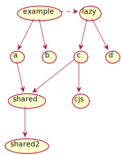
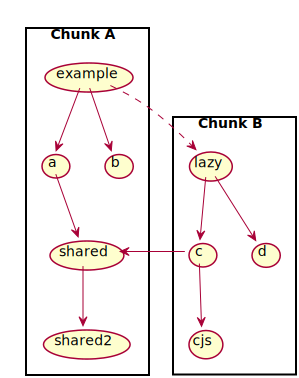
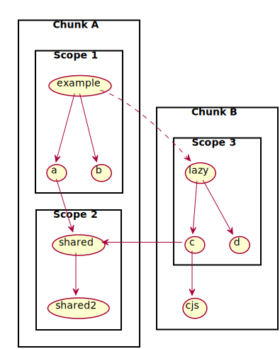

This example demonstrates Scope Hoisting in combination with Code Splitting.

This is the dependency graph for the example: (solid lines express sync imports, dashed lines async imports)



All modules except `cjs` are EcmaScript modules. `cjs` is a CommonJs module.

The interesting thing here is that putting all modules in single scope won't work, because of multiple reasons:

* Modules `lazy`, `c`, `d` and `cjs` need to be in a separate chunk
* Module `shared` is accessed by two chunks (difference scopes)
* Module `cjs` is a CommonJs module



webpack therefore uses a approach called **"Partial Scope Hoisting"** or "Module concatenation", which chooses the largest possible subsets of ES modules which can be scope hoisted and combines them with the default webpack primitives.



While module concatentation identifiers in modules are renamed to avoid conflicts and internal imports are simplified. External imports and exports from the root module use the existing ESM constructs.

# example.js

``` javascript
import { a, x, y } from "a";
import * as b from "b";

import("./lazy").then(function(lazy) {
	console.log(a, b.a(), x, y, lazy.c, lazy.d.a, lazy.x, lazy.y);
});
```

# lazy.js

``` javascript
export * from "c";
import * as d from "d";
export { d };
```

# a.js

``` javascript
// module a
export var a = "a";
export * from "shared";
```

# b.js

``` javascript
// module b
export function a() {
	return "b";
};
```

# c.js

``` javascript
// module c
import { c as e } from "cjs";

export var c = String.fromCharCode(e.charCodeAt(0) - 2);

export { x, y } from "shared";
```

# d.js

``` javascript
// module d
export var a = "d";
```

# cjs.js

``` javascript
// module cjs (commonjs)
exports.c = "e";
```

# shared.js

``` javascript
// shared module
export var x = "x";
export * from "shared2";
```

# shared2.js

``` javascript
// shared2 module
export var y = "y";
```


# webpack.config.js

``` javascript
var webpack = require("../../");

module.exports = {
	plugins: [
		new webpack.optimize.ModuleConcatenationPlugin()
	]
};
```


# js/output.js

<details><summary><code>/******/ (function(modules) { /* webpackBootstrap */ })</code></summary>

``` javascript
/******/ (function(modules) { // webpackBootstrap
/******/ 	// install a JSONP callback for chunk loading
/******/ 	var parentJsonpFunction = window["webpackJsonp"];
/******/ 	window["webpackJsonp"] = function webpackJsonpCallback(chunkIds, moreModules, executeModules) {
/******/ 		// add "moreModules" to the modules object,
/******/ 		// then flag all "chunkIds" as loaded and fire callback
/******/ 		var moduleId, chunkId, i = 0, resolves = [], result;
/******/ 		for(;i < chunkIds.length; i++) {
/******/ 			chunkId = chunkIds[i];
/******/ 			if(installedChunks[chunkId]) {
/******/ 				resolves.push(installedChunks[chunkId][0]);
/******/ 			}
/******/ 			installedChunks[chunkId] = 0;
/******/ 		}
/******/ 		for(moduleId in moreModules) {
/******/ 			if(Object.prototype.hasOwnProperty.call(moreModules, moduleId)) {
/******/ 				modules[moduleId] = moreModules[moduleId];
/******/ 			}
/******/ 		}
/******/ 		if(parentJsonpFunction) parentJsonpFunction(chunkIds, moreModules, executeModules);
/******/ 		while(resolves.length) {
/******/ 			resolves.shift()();
/******/ 		}
/******/
/******/ 	};
/******/
/******/ 	// The module cache
/******/ 	var installedModules = {};
/******/
/******/ 	// objects to store loaded and loading chunks
/******/ 	var installedChunks = {
/******/ 		1: 0
/******/ 	};
/******/
/******/ 	var resolvedPromise = new Promise(function(resolve) { resolve(); });
/******/
/******/ 	// The require function
/******/ 	function __webpack_require__(moduleId) {
/******/
/******/ 		// Check if module is in cache
/******/ 		if(installedModules[moduleId]) {
/******/ 			return installedModules[moduleId].exports;
/******/ 		}
/******/ 		// Create a new module (and put it into the cache)
/******/ 		var module = installedModules[moduleId] = {
/******/ 			i: moduleId,
/******/ 			l: false,
/******/ 			exports: {}
/******/ 		};
/******/
/******/ 		// Execute the module function
/******/ 		modules[moduleId].call(module.exports, module, module.exports, __webpack_require__);
/******/
/******/ 		// Flag the module as loaded
/******/ 		module.l = true;
/******/
/******/ 		// Return the exports of the module
/******/ 		return module.exports;
/******/ 	}
/******/
/******/ 	// This file contains only the entry chunk.
/******/ 	// The chunk loading function for additional chunks
/******/ 	__webpack_require__.e = function requireEnsure(chunkId) {
/******/ 		if(installedChunks[chunkId] === 0) {
/******/ 			return resolvedPromise;
/******/ 		}
/******/
/******/ 		// a Promise means "currently loading".
/******/ 		if(installedChunks[chunkId]) {
/******/ 			return installedChunks[chunkId][2];
/******/ 		}
/******/
/******/ 		// setup Promise in chunk cache
/******/ 		var promise = new Promise(function(resolve, reject) {
/******/ 			installedChunks[chunkId] = [resolve, reject];
/******/ 		});
/******/ 		installedChunks[chunkId][2] = promise;
/******/
/******/ 		// start chunk loading
/******/ 		var head = document.getElementsByTagName('head')[0];
/******/ 		var script = document.createElement('script');
/******/ 		script.type = 'text/javascript';
/******/ 		script.charset = 'utf-8';
/******/ 		script.async = true;
/******/ 		script.timeout = 120000;
/******/
/******/ 		if (__webpack_require__.nc) {
/******/ 			script.setAttribute("nonce", __webpack_require__.nc);
/******/ 		}
/******/ 		script.src = __webpack_require__.p + "" + chunkId + ".output.js";
/******/ 		var timeout = setTimeout(onScriptComplete, 120000);
/******/ 		script.onerror = script.onload = onScriptComplete;
/******/ 		function onScriptComplete() {
/******/ 			// avoid mem leaks in IE.
/******/ 			script.onerror = script.onload = null;
/******/ 			clearTimeout(timeout);
/******/ 			var chunk = installedChunks[chunkId];
/******/ 			if(chunk !== 0) {
/******/ 				if(chunk) {
/******/ 					chunk[1](new Error('Loading chunk ' + chunkId + ' failed.'));
/******/ 				}
/******/ 				installedChunks[chunkId] = undefined;
/******/ 			}
/******/ 		};
/******/ 		head.appendChild(script);
/******/
/******/ 		return promise;
/******/ 	};
/******/
/******/ 	// expose the modules object (__webpack_modules__)
/******/ 	__webpack_require__.m = modules;
/******/
/******/ 	// expose the module cache
/******/ 	__webpack_require__.c = installedModules;
/******/
/******/ 	// identity function for calling harmony imports with the correct context
/******/ 	__webpack_require__.i = function(value) { return value; };
/******/
/******/ 	// define getter function for harmony exports
/******/ 	__webpack_require__.d = function(exports, name, getter) {
/******/ 		if(!__webpack_require__.o(exports, name)) {
/******/ 			Object.defineProperty(exports, name, {
/******/ 				configurable: false,
/******/ 				enumerable: true,
/******/ 				get: getter
/******/ 			});
/******/ 		}
/******/ 	};
/******/
/******/ 	// getDefaultExport function for compatibility with non-harmony modules
/******/ 	__webpack_require__.n = function(module) {
/******/ 		var getter = module && module.__esModule ?
/******/ 			function getDefault() { return module['default']; } :
/******/ 			function getModuleExports() { return module; };
/******/ 		__webpack_require__.d(getter, 'a', getter);
/******/ 		return getter;
/******/ 	};
/******/
/******/ 	// Object.prototype.hasOwnProperty.call
/******/ 	__webpack_require__.o = function(object, property) { return Object.prototype.hasOwnProperty.call(object, property); };
/******/
/******/ 	// __webpack_public_path__
/******/ 	__webpack_require__.p = "js/";
/******/
/******/ 	// on error function for async loading
/******/ 	__webpack_require__.oe = function(err) { console.error(err); throw err; };
/******/
/******/ 	// Load entry module and return exports
/******/ 	return __webpack_require__(__webpack_require__.s = 0);
/******/ })
/************************************************************************/
```

</details>

``` javascript
/******/ ([
/* 0 */
/* unknown exports provided */
/* all exports used */
/*!********************************!*\
  !*** ./example.js + 2 modules ***!
  \********************************/
/***/ (function(module, __webpack_exports__, __webpack_require__) {

"use strict";
Object.defineProperty(exports, "__esModule", { value: true });

// CONCATENAMED MODULE: ./node_modules/a.js
/* harmony import */ var __WEBPACK_IMPORTED_MODULE_0_shared__ = __webpack_require__(/*! shared */ 1);
// module a
var a = "a";


// CONCATENAMED MODULE: ./node_modules/b.js
// module b
function b_js_a() {
	return "b";
};

// CONCATENAMED MODULE: ./example.js


__webpack_require__.e/* import() */(0).then(__webpack_require__.bind(null, /*! ./lazy */ 2)).then(function(lazy) {
	console.log(a, b_js_a(), __WEBPACK_IMPORTED_MODULE_0_shared__["x"], __WEBPACK_IMPORTED_MODULE_0_shared__["y"], lazy.c, lazy.d.a, lazy.x, lazy.y);
});


/***/ }),
/* 1 */
/* exports provided: x, y */
/* exports used: x, y */
/*!********************************************!*\
  !*** ./node_modules/shared.js + 1 modules ***!
  \********************************************/
/***/ (function(module, __webpack_exports__, __webpack_require__) {

"use strict";
Object.defineProperty(exports, "__esModule", { value: true });

// CONCATENAMED MODULE: ./node_modules/shared2.js
// shared2 module
var y = "y";

// CONCATENAMED MODULE: ./node_modules/shared.js
/* harmony export (binding) */ __webpack_require__.d(__webpack_exports__, "a", function() { return x; });
/* concated harmony reexport */__webpack_require__.d(__webpack_exports__, "y", function() { return y; });
// shared module
var x = "x";


/***/ })
/******/ ]);
```

# js/0.output.js

``` javascript
webpackJsonp([0],[
/* 0 */,
/* 1 */,
/* 2 */
/* exports provided: d, c, x, y */
/* all exports used */
/*!*****************************!*\
  !*** ./lazy.js + 2 modules ***!
  \*****************************/
/***/ (function(module, __webpack_exports__, __webpack_require__) {

"use strict";
Object.defineProperty(exports, "__esModule", { value: true });

// CONCATENAMED MODULE: ./node_modules/c.js
/* harmony import */ var __WEBPACK_IMPORTED_MODULE_0_cjs__ = __webpack_require__(/*! cjs */ 3);
/* harmony import */ var __WEBPACK_IMPORTED_MODULE_0_cjs___default = __webpack_require__.n(__WEBPACK_IMPORTED_MODULE_0_cjs__);
/* harmony import */ var __WEBPACK_IMPORTED_MODULE_1_shared__ = __webpack_require__(/*! shared */ 1);
// module c


var c = String.fromCharCode(__WEBPACK_IMPORTED_MODULE_0_cjs__["c"].charCodeAt(0) - 2);


// CONCATENAMED MODULE: ./node_modules/d.js
var d_js_namespaceObject = {};
__webpack_require__.d(d_js_namespaceObject, "a", function() { return a; });
// module d
var a = "d";

// CONCATENAMED MODULE: ./lazy.js
/* concated harmony reexport */__webpack_require__.d(__webpack_exports__, "c", function() { return c; });
/* concated harmony reexport */__webpack_require__.d(__webpack_exports__, "x", function() { return __WEBPACK_IMPORTED_MODULE_1_shared__["x"]; });
/* concated harmony reexport */__webpack_require__.d(__webpack_exports__, "y", function() { return __WEBPACK_IMPORTED_MODULE_1_shared__["y"]; });
/* concated harmony reexport */__webpack_require__.d(__webpack_exports__, "d", function() { return d_js_namespaceObject; });


/***/ }),
/* 3 */
/* unknown exports provided */
/* exports used: c */
/*!*****************************!*\
  !*** ./node_modules/cjs.js ***!
  \*****************************/
/***/ (function(module, exports) {

// module cjs (commonjs)
exports.c = "e";


/***/ })
]);
```

Minimized

``` javascript
webpackJsonp([0],[,,function(n,r,t){"use strict";Object.defineProperty(exports,"__esModule",{value:!0});var e=t(3),u=(t.n(e),t(1)),c=String.fromCharCode(e.c.charCodeAt(0)-2),o={};t.d(o,"a",function(){return d});var d="d";t.d(r,"c",function(){return c}),t.d(r,"x",function(){return u.x}),t.d(r,"y",function(){return u.y}),t.d(r,"d",function(){return o})},function(n,r){r.c="e"}]);
```

# Info

## Uncompressed

```
Hash: 383b132e31f349cdb930
Version: webpack 2.5.1
      Asset     Size  Chunks             Chunk Names
0.output.js  1.85 kB       0  [emitted]  
  output.js  7.53 kB       1  [emitted]  main
Entrypoint main = output.js
chunk    {0} 0.output.js 276 bytes {1} [rendered]
    > [4] 4:0-16
    [2] ./lazy.js + 2 modules 232 bytes {0} [built]
        [exports: d, c, x, y]
        [no exports used]
        import() ./lazy [4] ./example.js 4:0-16
    [3] ./node_modules/cjs.js 44 bytes {0} [built]
        [only some exports used: c]
        harmony import cjs [8] ./node_modules/c.js 2:0-29
chunk    {1} output.js (main) 385 bytes [entry] [rendered]
    > main [4] 
    [0] ./example.js + 2 modules 280 bytes {1} [built]
        [no exports used]
    [1] ./node_modules/shared.js + 1 modules 105 bytes {1} [built]
        [exports: x, y]
        [no exports used]
        harmony import shared [6] ./node_modules/a.js 3:0-23
        harmony import shared [8] ./node_modules/c.js 6:0-30
```

## Minimized (uglify-js, no zip)

```
Hash: 383b132e31f349cdb930
Version: webpack 2.5.1
      Asset       Size  Chunks             Chunk Names
0.output.js  379 bytes       0  [emitted]  
  output.js    1.73 kB       1  [emitted]  main
Entrypoint main = output.js
chunk    {0} 0.output.js 276 bytes {1} [rendered]
    > [4] 4:0-16
    [2] ./lazy.js + 2 modules 232 bytes {0} [built]
        [exports: d, c, x, y]
        [no exports used]
        import() ./lazy [4] ./example.js 4:0-16
    [3] ./node_modules/cjs.js 44 bytes {0} [built]
        [only some exports used: c]
        harmony import cjs [8] ./node_modules/c.js 2:0-29
chunk    {1} output.js (main) 385 bytes [entry] [rendered]
    > main [4] 
    [0] ./example.js + 2 modules 280 bytes {1} [built]
        [no exports used]
    [1] ./node_modules/shared.js + 1 modules 105 bytes {1} [built]
        [exports: x, y]
        [no exports used]
        harmony import shared [6] ./node_modules/a.js 3:0-23
        harmony import shared [8] ./node_modules/c.js 6:0-30
```
